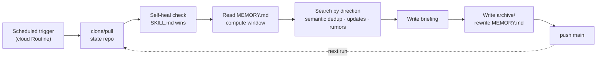

# claude-briefings

[](LICENSE)
[](https://claude.ai/code)
[](https://claude.ai/code/routines)

[中文](README.md) | English

A reusable spec for generating recurring topic briefings with Claude Code Routines. The git repository carries all state — task definitions, cross-run memory, and archived issues live here, and `main` is the single source of truth. Runs on a schedule in the cloud; your machine doesn't need to be on.

**How this differs from the usual "RSS scraper + LLM summary" setup:**

- **Zero infrastructure, zero secrets** — no scraper code, no server, no API keys to configure; after forking, the only thing to set up is the Routine itself.
- **Cross-run, event-level semantic dedup** — dedup memory persists in git, so the same story is recognized even under a different outlet, headline, or URL; most comparable projects hash links, or dedup only within a single run.
- **Gaps refill the coverage window, not just the run** — pause for three days and the next run backfills those three days instead of starting over from "today".
- **Pure prompt-as-spec** — the task definition *is* the Routine's prompt; changing behavior means editing markdown and pushing, with no runtime code to maintain.

**Sample output (real archives):** [Tech news briefing · 2026-07-26](tech-news-briefing/archive/tech-news-briefing_2026-07-26.md) · [AI industry briefing · 2026-07-26](ai-industry-briefing/archive/ai-industry-briefing_2026-07-26.md) · [more](tech-news-briefing/archive/) *(output language is per-task; current tasks publish in Chinese)*

## The problem it solves

The hard part of a scheduled briefing isn't retrieval — it's **continuity**:

- Never re-report an already-covered event (event-level semantic dedup that survives outlet/headline changes);
- Follow developing stories ([UPDATE] mechanism, with targeted searches driven by each story's "what to watch next");
- Include credible but unannounced news ([RUMOR] mechanism: name the source, track until confirmed or debunked);
- Label evidence strength ([SINGLE-SOURCE] / [CONFLICTING]) instead of passing unverified items off as settled;
- After downtime, backfill the missed window automatically — no gaps, no duplicates.

All of these mechanisms live in one task template; each new task is just an instantiation.

## Repository layout

```
├── _template/SKILL.md      # The task spec (single authority): assembly checklist + runtime body skeleton
├── <topic-slug>/           # One directory per task
│   ├── SKILL.md            # Task definition (body = the Routine's prompt, verbatim)
│   ├── MEMORY.md           # Cross-run memory (machine-managed; absent before first run)
│   └── archive/            # One snapshot per issue, append-only
├── skills/new-briefing/    # Claude Code skill: one-line topic → fully assembled new task
├── CONTEXT.md              # Glossary
├── docs/adr/               # Architecture decision records (why it's built this way)
```

## Lifecycle of one run



Every day, the cloud Routine executes one full lifecycle:

1. clone/pull this repository;
2. **Self-heal check**: if the task's `SKILL.md` body differs from the registered prompt, the file wins (to change a task, edit the file and push — never touch the Routine);
3. Read `MEMORY.md` and compute the coverage window (since the last run, capped at N days; rebuilt from archives if missing);
4. Search by direction, dedup at event level, and check every entry in the open-stories table;
5. Produce the briefing → write `archive/` and `MEMORY.md` → commit and `git push origin HEAD:main` (if rejected, fall back to a `claude/*` branch that an Action auto-merges into main).

## Build your own

```bash
# 1. Fork this repo, clone it, run the one-shot setup (installs the new-briefing skill; paths and repo URL are auto-detected)
git clone https://github.com/<you>/<your-fork>.git && cd <your-fork> && ./setup.sh

# 2. Connect GitHub inside Claude Code (once)
/web-setup

# 3. Create a briefing task: sections designed, files assembled and pushed, Routine instructions provided
/new-briefing <topic>
```

Then follow the printed instructions to create the Routine at [claude.ai/code/routines](https://claude.ai/code/routines) (a web step that can't be automated): bind your repository and set the schedule; after creating, remove unneeded connectors in the *edit* dialog (removals in the create form don't stick).

Changing briefing content = edit `SKILL.md` and push. Changing the run time = edit the Routine schedule. The two never mix.

## Design docs

- Glossary: [CONTEXT.md](CONTEXT.md)
- Decision records: [docs/adr/](docs/adr/) (memory/archive separation, file-as-authority + self-heal, cloud Routines + git state repo)
- Task spec: [_template/SKILL.md](_template/SKILL.md)

## Note

This repository is public (unauthenticated clone from the cloud, see ADR-0003): **never commit credentials, tokens, or any sensitive information.**

## License

MIT
