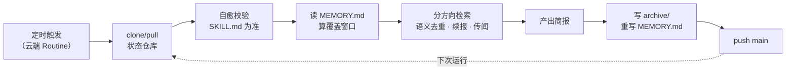

# claude-briefings

[](LICENSE)
[](https://claude.ai/code)
[](https://claude.ai/code/routines)

中文 | [English](README.en.md)

用 Claude Code Routines 定时自动生成主题简报的一套可复用规范。git 仓库承载全部状态——任务定义、跨运行记忆、历史归档都在这里，`main` 即唯一事实；云端定时运行，本机无需开机。

**和常见"RSS 抓取 + LLM 摘要"方案的差别：**

- **零基础设施、零 secret**——没有爬虫代码、没有服务器、不需要配任何 API key；fork 之后要建的只有 Routine 本身。
- **跨运行的事件级语义去重**——去重记忆持久在 git 里，同一事件换媒体、换标题、换链接也认得出；同类项目多为链接哈希，或只在单次运行内去重。
- **断档补的是覆盖窗口，不只是补跑**——停三天，回来自动补上这三天的内容，而不是从"今天"重新开始。
- **纯 prompt 规范**——任务定义本身就是 Routine 的 prompt，改行为 = 改 markdown 并 push，没有运行时代码要维护。

**示例产出（真实归档）：** [科技新闻简报 · 2026-07-26](tech-news-briefing/archive/tech-news-briefing_2026-07-26.md) · [AI 行业简报 · 2026-07-26](ai-industry-briefing/archive/ai-industry-briefing_2026-07-26.md) · [更多归档](tech-news-briefing/archive/)

## 解决什么问题

简报类定时任务的难点不在检索，在**连续性**：

- 不重复报已报过的事件（按事件级语义去重，换媒体换标题也认得出）；
- 追踪进行中事件的后续（【续报】机制，按每个事件的"下一步关注点"定向检索）；
- 收录未官宣但有可信度的消息（【传闻】机制，写明信源、跟踪至证实或辟谣）；
- 标注证据强度（【单源】/【矛盾】），交叉验证不过关的条目不冒充定论；
- 断档几天后自动补窗，而不是漏报或重报。

这些机制全部写进一份任务模板，每个新任务只需实例化。

## 仓库结构

```
├── _template/SKILL.md      # 任务规范（唯一权威）：装配 checklist + 运行时正文骨架
├── <topic-slug>/           # 每个任务一个目录
│   ├── SKILL.md            # 任务定义（正文 = Routine 的 prompt，逐字）
│   ├── MEMORY.md           # 跨运行记忆（机器读写，首次运行前不存在）
│   └── archive/            # 每期简报快照，只增不改
├── skills/new-briefing/    # Claude Code 技能：一句话 topic → 自动装配新任务
├── .github/workflows/      # auto-merge（分支兜底合并）+ briefing-watchdog（缺失告警）
├── CONTEXT.md              # 术语表
├── docs/adr/               # 架构决策记录（为什么这么设计）
```

## 缺失告警

调度器可能静默停摆（不触发、无运行记录），单次运行也可能中途失败而不落盘——两种情况都不会自己冒泡。
`briefing-watchdog` 每天 19:00 UTC 检查各任务当天（周更任务则为其应跑当天）是否落了归档，缺失就开 Issue；
持续缺失只在同一个 Issue 追加评论，全部恢复后自动关闭。新增或改动任务的更新频率时，同步改该 workflow 里的
`DAILY` / `WEEKLY` 两个列表。

## 一次运行的生命周期



每到点，云端 Routine 执行一次完整生命周期（频率按任务而定，日更或周更）：

1. clone/pull 本仓库；
2. **自愈校验**：任务 `SKILL.md` 正文与注册 prompt 不一致时，以文件为准执行（改任务只需改文件并 push，无需碰 Routine）；
3. 读 `MEMORY.md` 计算覆盖窗口（自上次运行至今，封顶 N 天；缺失时从归档重建）;
4. 分方向检索，按事件级语义去重，逐一核查进行中事件表；
5. 产出简报 → 写 `archive/` 与 `MEMORY.md` → commit 并 `git push origin HEAD:main`（被拒则退推 `claude/*` 分支，由 Action 自动并入 main）。

## 自己搭一套

```bash
# 1. Fork 本仓库，clone 到本机，进目录跑一键配置（安装 new-briefing 技能，路径与仓库地址全自动）
git clone https://github.com/<你的用户名>/<你的fork>.git && cd <你的fork> && ./setup.sh

# 2. Claude Code 里连接 GitHub（首次一次）
/web-setup

# 3. 建一个简报任务：自动设计板块、装配、推送，并给出 Routine 创建指引
/new-briefing 〈主题〉
```

最后照指引在 [claude.ai/code/routines](https://claude.ai/code/routines) 创建 Routine（网页操作无法自动化）：绑定你的仓库、设定时；创建后在编辑弹窗里移除不需要的连接器（创建表单里移除不生效）。

改简报内容 = 改 `SKILL.md` 并 push；改运行时间 = 只改 Routine 调度。两者永不混放。

## 设计文档

- 术语表：[CONTEXT.md](CONTEXT.md)
- 决策记录：[docs/adr/](docs/adr/)（记忆与归档分离、文件为唯一权威源 + 自愈、云端 Routines + git 状态仓库）
- 任务规范：[_template/SKILL.md](_template/SKILL.md)

## 注意

本仓库公开（云端免认证 clone，见 ADR-0003）：**任何凭据、令牌、敏感信息一律不得入库。**

## License

MIT
